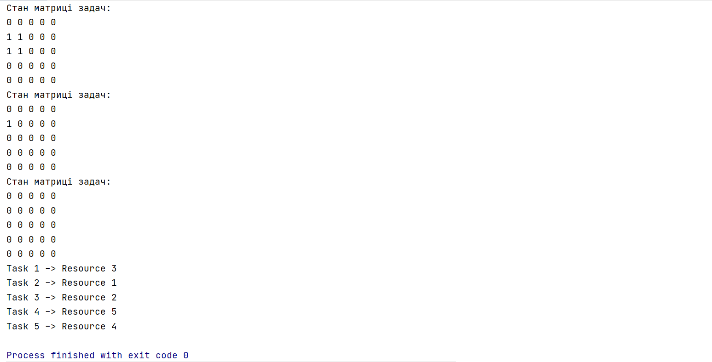

# Spatial Planner
## non-exclusive principle

## Theory

**Real-time** planning is characterized by the solution of the next problem - the definition of a plan for solving a set of tasks with a given execution time 
and time constraints on the output of tasks from the system. The planning system must meet the requirement to minimize the total time of deviations of actual outputs 
from the system (execution of decision deadlines) from the initial time limits (the planning system is informed of the time of entry into the system, decision time 
and final exit time) in full compliance with the procedure. The problem belongs to the class of NP-complete.

## Algorithm description

The essence of **planning, which does not exclude**, is as follows.
We need to find such appointments that we can't do without - that is, those that claim a single resource.
It is necessary to find in a destination matrix such line which contains only one unit, on this cell to execute assignments, and to reduce a matrix.
The same assumption can be made about the resource - if the resource claims one task - it must be assigned to it. This is a search for a unit in a column, 
followed by the same purpose. There are cases when the matrix is not reduced to the end - there are no rows / columns in which only one unit - therefore, 
perform the appointment randomly - especially the result will not be affected, and then reduce the matrix.

## Program execution results

